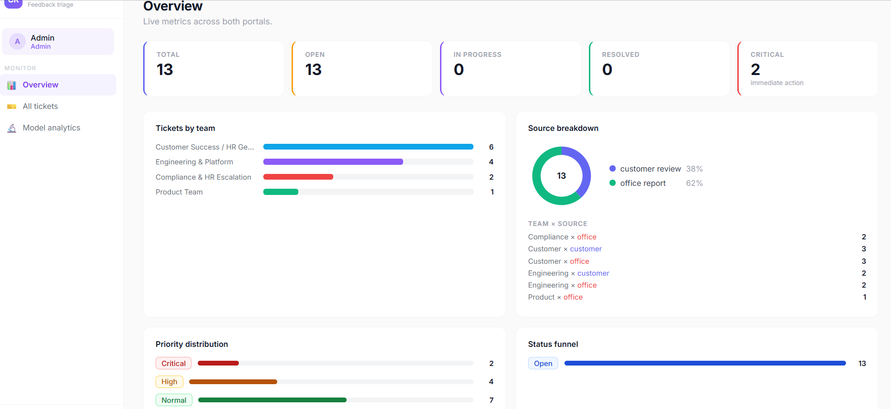
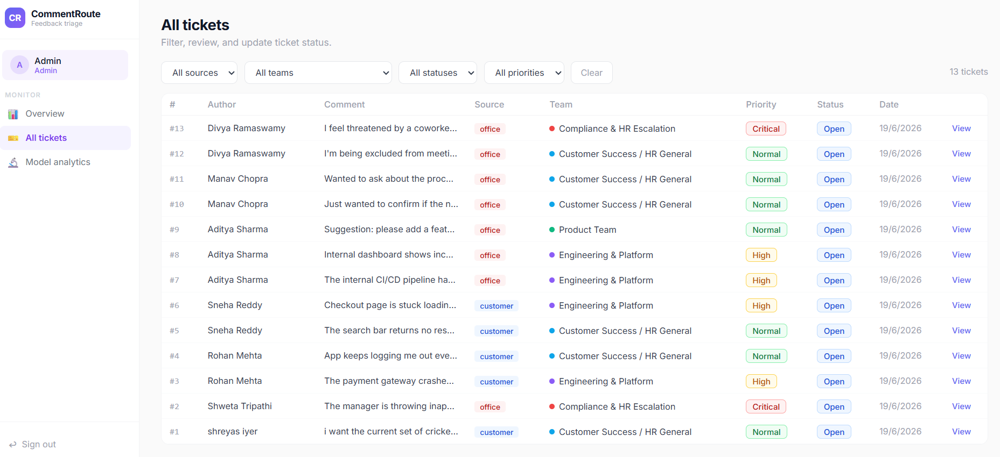
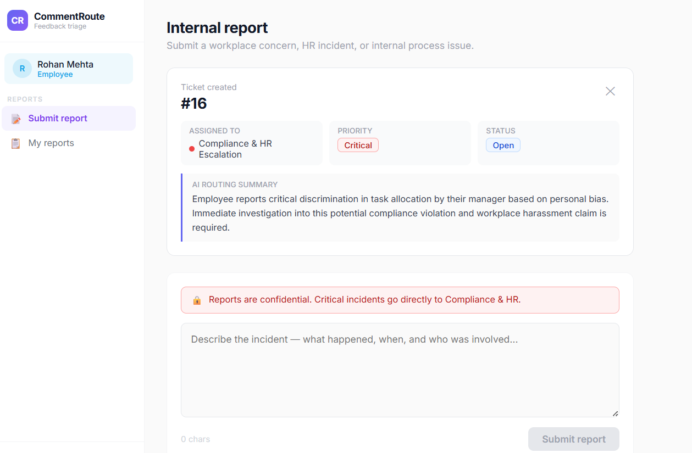

# CommentRoute

**AI-Powered Feedback Triage & Workplace Incident Management Platform**

A full-stack SaaS platform that classifies incoming text submissions — from customer product reviews and internal employee reports — using a trained NLP model, applies business routing rules, and generates AI-written action summaries for the receiving team.

**Live demo:** https://commentrouteprediction.vercel.app  
**API docs:** https://commentrouteprediction.onrender.com/docs

---

## Demo Credentials

```
Admin login:
Email:    admin@commentroute.com
Password: admin123

Customer / Employee portals:
Just enter any name — no password required (demo build)
```

---

## Screenshots





---

## The Problem

Organizations receive high volumes of unstructured text daily — product reviews, bug reports, feature requests, service complaints, and internal workplace communications. Manually reading and routing every submission to the correct team is slow, inconsistent, and doesn't scale.

CommentRoute automates this end to end:

```
Text submission
       ↓
LightGBM classification (TF-IDF + engineered features)
       ↓
Keyword override rules (domain-specific routing signals)
       ↓
Priority assignment (label + source portal context)
       ↓
Gemini 2.5 Flash routing summary
       ↓
Ticket stored + team notified
       ↓
Admin analytics dashboard
```

---

## Two Portals, One Backend

| Portal | Who | Submission type |
|---|---|---|
| **Customer** | External users | Product reviews, bug reports, feature requests, complaints |
| **Employee** | Internal staff | Workplace concerns, conduct reports, internal tool issues, process feedback |

Both flow through the same classification and routing pipeline, but priority logic differs by context — a conduct-related report submitted through the employee portal is automatically escalated to **Critical** priority and routed directly to Compliance & HR, without the submitter needing to self-categorize the issue.

---

## Tech Stack

| Layer | Technology |
|---|---|
| Frontend | React 18, Vite, vanilla CSS-in-JS |
| Backend | FastAPI, Python 3.11 |
| Database | SQLite + SQLAlchemy ORM |
| ML Model | LightGBM + TF-IDF (scikit-learn Pipeline) |
| LLM | Gemini 2.5 Flash |
| Model hosting | Hugging Face Hub |
| Deployment | Vercel (frontend) + Render (backend) |
| Testing | Pytest (21 tests) |

---

## ML Model

- **Algorithm:** LightGBM Classifier
- **Text features:** TF-IDF, 50,000 features, unigrams + bigrams
- **Additional features:** 27 engineered columns (text statistics, engagement metadata, temporal features)
- **Categorical encoding:** OneHotEncoder
- **Training samples:** 158,400 / Validation: 39,600
- **Validation Macro F1:** 0.8156
- **Classes:** 4, mapped to business teams for this application

> Model outputs are mapped to business workflows for demonstration purposes — the original training labels were anonymized competition categories, remapped here to reflect realistic SaaS routing logic.

---

## Routing Logic

The system uses a **hybrid routing engine** — not a pure black-box model — combining ML classification with deterministic business rules:

```
1. LightGBM classifies the raw text → label (0–3)
2. Keyword override rules check for high-confidence signals:
   - Conduct/compliance language → Compliance & HR Escalation
   - Technical/error language     → Engineering & Platform
   - Suggestion/request language  → Product Team
3. If no override fires, fall back to the LightGBM label mapping
4. Priority assigned based on (label, source_type) combination
5. Gemini generates a 1–2 sentence routing summary for the team
```

This hybrid design exists because the underlying ML model wasn't trained on this exact domain — keyword rules correct for cases where the model's training distribution doesn't match production traffic, which is a realistic and common pattern in deployed ML systems.

| Label | Team | Priority (customer) | Priority (employee) |
|---|---|---|---|
| 0 | Customer Success / HR General | Normal | Normal |
| 1 | Engineering & Platform | High | High |
| 2 | Product Team | Normal | Normal |
| 3 | Compliance & HR Escalation | High | **Critical** |

---

## Database Schema

```
users            id, name, email, role, source_type, department, created_at
tickets          ticket_id, user_id, author_name, comment, source_type,
                 predicted_label, assigned_team, routing_note,
                 status, priority, created_at
ticket_history   id, ticket_id, old_status, new_status, changed_by, updated_at
internal_notes   id, ticket_id, author, note, created_at
```

Single unified database for both portals — source is tracked as metadata rather than split across separate tables, which lets the admin run cross-portal analytics (e.g. "how many Engineering tickets come from customers vs. internal staff").

---

## API Endpoints

| Method | Path | Description |
|---|---|---|
| POST | `/submit_ticket` | Classify and route a new submission |
| GET | `/tickets` | List tickets (filterable by team, status, source, priority) |
| GET | `/tickets/{id}` | Full ticket detail with status history and notes |
| PATCH | `/tickets/{id}/status` | Update ticket status, logged to history |
| POST | `/tickets/{id}/notes` | Add an internal note to a ticket |
| GET | `/dashboard/stats` | Full analytics: team/source/priority breakdowns, ML label distribution |
| GET | `/health` | Health check |

Full interactive documentation: `/docs` (Swagger UI)

---

## Admin Dashboard

- **Overview** — live stat cards, tickets-by-team bar chart, source breakdown donut chart, team × source cross-tab, priority distribution, status funnel
- **All Tickets** — filterable table (source, team, status, priority), ticket detail modal with inline status updates and full audit history
- **Model Analytics** — raw LightGBM label distribution (separate from post-override routing, for model drift monitoring), training metadata, routing pipeline visualization

---

## Local Setup

### Backend

```bash
cd commentroute-backend
python -m venv venv
source venv/bin/activate        # Windows: venv\Scripts\activate
pip install -r requirements.txt

cp .env.example .env
# Add GEMINI_API_KEY to .env

# Place your trained model at:
# app/ml_models/model_pipeline.joblib

uvicorn app.main:app --reload --port 8000
```

### Frontend

```bash
cd commentroute-frontend
npm install
npm run dev
```

Frontend: `http://localhost:5173`  
API docs: `http://localhost:8000/docs`

### Tests

```bash
cd commentroute-backend
pytest -v   # 21 tests
```

---

## Deployment Notes

- **Backend (Render):** Python version pinned via `.python-version` (3.11.9) to avoid scikit-learn build failures on newer Python releases. `scikit-learn` version in `requirements.txt` matched exactly to the training environment to avoid pickle incompatibility errors on model load.
- **Model hosting:** The trained `.joblib` pipeline (~58MB) exceeds comfortable GitHub limits and Render's free tier has no persistent disk, so the model is hosted on Hugging Face Hub and downloaded at application startup via `MODEL_DOWNLOAD_URL`.
- **Frontend (Vercel):** `VITE_API_URL` environment variable points to the Render backend URL.

---

## Known Limitations / Honest Notes

- No real authentication — admin login is a hardcoded credential pair, customer/employee portals require only a name. Appropriate for a demo; not production-auth.
- SQLite is used for simplicity; a production deployment would use PostgreSQL.
- Render free tier sleeps after inactivity — first request after idle may take 10–15 seconds while the model re-downloads.
- The ML model's original training labels were not domain-specific to this application; keyword override rules compensate for this gap (see Routing Logic above).

---

## Possible Next Steps (Not Implemented)

- **RAG-based pattern detection:** embed historical tickets, retrieve similar past cases, and have the LLM reference patterns (e.g. "this is the 8th similar report this month") rather than treating each ticket in isolation
- **Real authentication** (JWT, password hashing) for production use
- **Email notifications** to assigned teams on ticket creation
- **PostgreSQL migration** for production-scale concurrent writes

---

## Tech Summary

`Python` · `FastAPI` · `React` · `LightGBM` · `TF-IDF` · `scikit-learn` · `Gemini API` · `SQLite` · `SQLAlchemy` · `Pytest` · `Vite` · `Vercel` · `Render` · `Hugging Face Hub`
